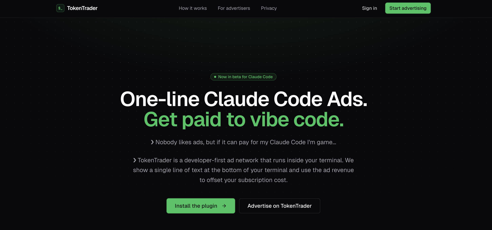

# TokenTrader

[](https://tokentrader.dev)

**Earn back your Claude Code subscription by running small, non-invasive ads in your terminal.**

**Website:** [tokentrader.dev](https://tokentrader.dev)

TokenTrader is a Claude Code plugin that displays lightweight sponsored messages in the status bar while you work. You use Claude Code like normal — we show a single line of text at the bottom of your terminal and use the ad revenue to offset your subscription cost.

No popups. No banners. No interruptions. Just one dim line of ASCII text while you code.

```
 ▐▛███▜▌   Claude Code v2.1.96                                      
▝▜█████▛▘  Opus 4.6 with medium effort · Claude Max                 
  ▘▘ ▝▝    ~/repos                                                                                                                      
───────────────────────────────────────────────────────────────────────────────────────────────────────────────────────────────────────────────────────
❯ Normal prompt here, get paid while you vibe code!                                                                                                                                                 
───────────────────────────────────────────────────────────────────────────────────────────────────────────────────────────────────────────────────────
[ad] SecureLLMs.org: Secure AI/LLM deployments for the enterprise. Book demo → securellms.org
```

## How It Works

1. The plugin displays a single sponsored message in Claude Code's **status line** — the persistent bar at the bottom of the terminal.
2. After each Claude response, a verified impression is logged.
3. Earn enough impressions and you receive a free month of Claude Pro.

Check your progress any time with `/token-trader:status`:

```
⏺ TokenTrader — April 2026

  Earned this month:  $17.38 / $20.00
  [██████████████████████████████████▒░░░░░]  86.9%

  Impressions today:      142 / 200
  Impressions this month: 2,483

  At your current pace, gift card in ~3 days.
```

> **Roadmap:** We're working toward a direct Anthropic integration where ad revenue applies as credits against your usage limits automatically. If you're on the Anthropic team and interested in making this happen — we'd love to talk.

Ads are plain text, capped at 120 characters, and rendered with dim styling so they stay out of your way. No images, animation, or color injection.

## Installation

Open Claude Code and run:

```
/plugin marketplace add user-error1/token-trader
/plugin install token-trader@token-trader
/reload-plugins
```

That's it. Then sign in:

```
/token-trader:login
```

This kicks off the GitHub device flow — copy the code, approve in your browser, and you're earning credits. The plugin registers its own status-line hook, so small ads start rendering and you start getting paid. 

### Slash commands

```
/token-trader:login        Sign in with GitHub and register this device
/token-trader:logout       Logout of TokenTrader removing ads, auth, and device
/token-trader:status       Show current month's credit ledger
/token-trader:devices      List registered devices
/token-trader:sync         Force-flush the local impression queue to the backend
/token-trader:doctor       Health check across backend, auth, device key, queue
```

### Optional: bare CLI

Want to check status or sync from a regular terminal (outside Claude Code)? Clone the repo and run the setup script — this adds a `token-trader` binary to your `$PATH`. Not required for normal use.

```bash
git clone https://github.com/user-error1/token-trader
cd token-trader
./install.sh
```

```
token-trader login        Sign in with GitHub and register this device
token-trader logout       Delete local auth + device key
token-trader status       Show current month's credit ledger
token-trader devices      List registered devices (--revoke <prefix> to revoke one)
token-trader sync         Force-flush the local impression queue to the backend
token-trader doctor       Health check across backend, auth, device key, queue
token-trader help         Print usage
```

## About This Project

The TokenTrader plugin is **open source** — you can review, audit, and verify it doesn't log your keystrokes or content. However, it only works with the official TokenTrader backend at `https://token-trader-api.fly.dev`. The backend (impression verification, fraud detection, advertiser management, credit system) is proprietary and closed source.

## Ad Format

- Pure ASCII, single line, terminal-native font
- Max 120 characters including the `[ad]` prefix
- Dim ANSI styling — visible but unobtrusive
- No click required — URLs are displayed as plain text

## Privacy

- No keystrokes or content are logged
- Impression data includes only: timestamp, session ID, ad ID
- Logs are stored locally at `~/.token-trader/impressions.jsonl` before being synced to the backend

## License

MIT
